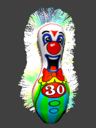
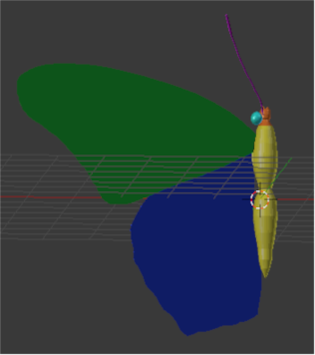
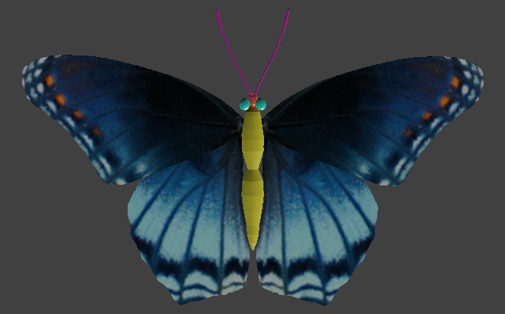

First, let's talk about my first Blender port to Unity. I was making a short FPS project and wanted a recognisable target. I decided on these targets which are found in certain carnival games, particularly at Dave & Busters, where some years before, my friend and I had spent an afternoon assaulting these weird clowns. I used a basic shape, like a bowling pin, then added a texture I drew on my iPad (Sketchbook). I took this opportunity to experiment with adding hair to a model, as the actual objects have sort of ostrich feather hair. 

However, when I ported my model into Blender, it lost its hair.
  

  
  

I eventually worked around it, as this is a common problem. The remedy does alter the look a bit, and I did not spend a lot of time trying to replicate the colours as they were in Blender. Is it the same? Not exactly. Is it good enough? It is! I can also see using this work around to make some interesting hairstyles with ease. 

I constructed the next three models for use on a project that was eventually abandoned. The cat is actually my first ever complete Blender model. I spent a lot of time, used reference photos, and lots of sculpting and smoothing to get the final product. I used mirroring to keep consistency for the model, as well. Initially, I was going to use realistic textures for the eyes, but that proved to be something out of actual nightmares. So, I used a simply painted UV map. If I were going to make this more realistic, I would use hair, instead of a smooth surface.

  

  
    
  

For the butterfly, I again used mirroring to keep the halves consistent. This time, I used actual photographs of a butterfly (limenitis arthemis or "red spotted purple butterfly") to texture the wings. To have them double sided, I just put two surfaces close together, the shored up the thickness. The body here is simply a black material, with its values adjusted, so it's not too shiny.

  

  
  
  
  

The daffodil is my favorite model. I used a simply painted UV map, much like the cat, but the effects I think are more realistic. The colours are meant to look like a Red Devon, which is a breed created in Devonshire. I adjusted the opacity of the leaf underneath, as it would have opened and died a bit, as the flower bloomed. I also added bones to this model, as I originally intended to use this model several times in a scene and wanted to easily be able to adjust the poses.

  

  
  
  
  
  
  

