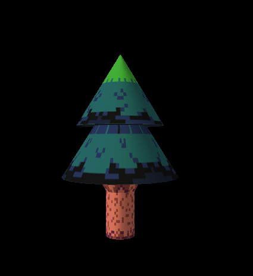
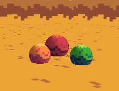
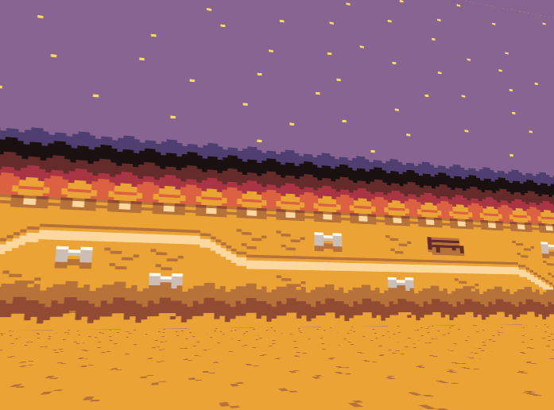
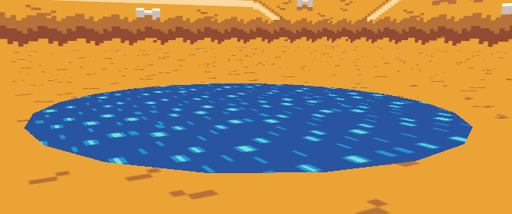

<figure class="video_container">
  <video controls="true" allowfullscreen="true" poster="../images/pixel forest 1a.png">
    <source src="../images/pixel forest demo.mp4" type="video/mp4">
  </video>
</figure>

I decided to make a small forest, using specific OpenGL framework provided by my module convener and pixel art (original credits to Grafxkid, but they have been heavily modified for this purpose). I love 2D pixel art, and it sounded like an interesting idea to use it in a 3D world. To do so, I redrew the graphics the I would use as skins so they could wrap around objects, rather than appear as flat planes.

For all objects, I used GLUquadric shapes: cylinder, sphere, and disk. I started by constructing the “leafy” trees. I used a cylinder for the trunk, a cone created from a cylinder for the branches, and a sphere for the top. I scaled the top to slightly skew the shape, so it is slightly wider and longer than it is tall. It is a very subtle change but gives a more pleasing look than a perfect sphere.  

I created the fir trees in much the same way, but with different proportions for the trunk and branches, and by using cones created from cylinders for the tiers. Each tier has a disk underneath, so the layers do not appear hollow, and I matched the colours using the RGB values from the textures. After each part could be drawn, it was simply a matter of placing them at the appropriate heights. I textured each part of the tree (the disks are just coloured) during each draw sequence. For both tree types, the branch cone is slightly inside the trunk cylinder, as placing them at exact height leaves an apparent line where the two shapes meet. Insetting the cone gives the branch and trunk textures the appearance of blending.

The bushes are simple spheres instead of complex shapes, as I felt this was more in tune with the scene and concept of a pixel forest. I considered rendering groups of spheres together to make interesting shapes, but I felt that option would have been more appropriate if the trees and other objects were not so purposefully simplistic. To give a more bush-like appearance, the objects are displayed slightly below the surface. I used another texturing technique, which entails inputting the texture location from MyScene.

If I had more time, I would have liked to make an algorithm to procedurally generate the trees and bushes, which would allow me to enter a range for their size, texture distribution ratio, number of each object, and area in which they would appear. This would have afforded a simple way to create a forest with a diversity of colour, as well as the size and shape of plants. In the end, instead of randomizing my textures, I opted to use different texturing techniques for different objects or components. I did so partly to show different texturing approaches, which I found interesting, and partly as I found different techniques were suitable for each object. For example, for the leafy trees, I combined approaches (elsewhere explained in this document) by texturing the trunk and branches during the draw methods of each, then assigning a GLuint for the top’s texture. I could then define multiple options in MyScene, which allowed me to choose which texture to use for each treetop.

The frog is constructed of a series of spheres. The body is a sphere that has been scaled to be slightly oblong, then rotated slightly on the x-axis, to give the appearance he is sitting upright. His feet are two flattened spheres rotated 25 degrees on the y-axis, to give them a playful arrangement. The sphere of the body has a texture and the feet colour is matched to the RGB value of that texture.

Right now, the frog hops for times in one direction, turns around, then four times back, before repeating. Again, if I had more time to dedicate to this project, I would have liked to randomize the direction and length of travel. When the frog jumps, his feet are rotated downward, to give the appearance of launching himself from the ground. Their positions are restored as he lands. I had intended during rest that the frog would expand and retract his throat, like a bullfrog, and worked out this sequence using a white gluSphere scaled and rotated, then hidden in his chest, that would rotate rhythmically. I did not end up leaving it in as, by this time, I felt I had already overcomplicated things.  

The skybox was very challenging, because I used this pre-built framework. A true skybox would be rendered around and set up to follow the camera, so the user would seem to be in an endless world and would never be able to reach what is on the horizon. I attempted several tutorials, but it seems to make this work, it would require I set up the camera differently, write and apply shaders, or set up an entirely different framework. In the end, it looks like you are inside a giant cube, despite significant effort. A pixel forest is not meant to be perfect.  

For the pond, there are many ways I could have rendered this disk. The most promising were a triangular array to create a disk and gluDisk. I ended up using the latter, mostly because I realized I would be able to stretch a texture across it without having to worry about making extra, special textures to afford triangles or any other possible distortions. To animate the pond, I used a technique to make a simple animation on the disk. Instead of changing sprite frames on a sprite map, I used multiple textures assigned on an array, and swapped them according to the frame and using a texID[(int)frame] I had bound to the disk.  

I had several ideas for lighting, such as using several positional lights or spotlights to give the feeling of stars. However, the number of lights per scene is limited to eight, so this would not be viable. I experimented with directional lights, but things were still either too bright or dim. In the end, I used a positional light located high up and to the left of everything, as if the pixel moon were casting a pale purple light on all the objects.  

The materials have their specular material set to black for everything, except the pond and frog. Had I not, the shadows of the three-dimensional objects would be unnecessarily harsh. I set the specular material of the pond to a low value of white, to give it a little pop, and reduced the transparency level of its specular material, to make it slightly transparent. I only set the material for the front face of the pond (all other object materials are front and back face), else transparency would not be possible. I made the frog “shiny” and increased its specular material’s value to 0.6, so he has an apparent sheen.
