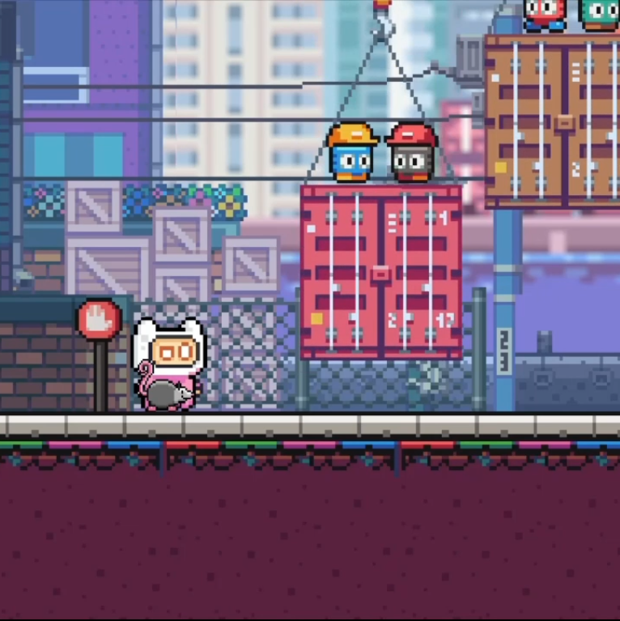

  
  
  
  

<iframe width="560" height="315" src="https://www.youtube.com/embed/QffNhnOr8LU" frameborder="0" allow="accelerometer; autoplay; encrypted-media; gyroscope; picture-in-picture" allowfullscreen></iframe>

## Introduction 
### Background
- As a fan of low-stress, self-paced, exploratory games, my aim was to create a small, contained narrative with a minimalistic approach. Death is not necessarily looming, but it is possible; there are fun elements that don’t progress the game, but don’t go completely off track (extra places to climb or bounce); and the level design and elements are not limited to one concept (obstacles, triggers, etc., could be altered to fit an expanded story and game).  
  - I took inspiration from games like Piku Niku, where the fun atmosphere and movements, as well as the playful aesthetics and narrative, are the focus. It’s challenging to do this on a small scale and quickly. 

### Story 
You find a possum eating trash in the city. This is no place for a possum. You feel a deep desire to take him to the wilderness, but first you must earn his trust. If you had better knowledge of possums, you would know that possums pretty much eat trash no matter their location. Your intentions are pure through your own ignorance, and that is fine. There are new dangers within the forest, but you will help the possum get past them to his friends. They enjoy disco, as do you.

## Prototype Design and Specification 
### Core Game Play 2D Side-Scrolling Platformer 
- Collect the possum and escort him to safety. 
  - Jump and climb to reach the goal. 
  - Avoid water, crushing hazards, and enemies. 
- Fulfil periodic requests by collecting and distributing items to overcome obstacles and progress. 
  - Player has a 1-slot HUD inventory, which is suitable. The HUD is hidden except within areas items can be used.  

### Game Flow 
- Player must overcome/solve obstacles to progress and the possum is required to advance levels. 
- As you move through each level, the jumps get more challenging. 
  - In Level 1, missing a jump initially sets you back in progress, but later will result in “death,” thus restarting the level. 
  - In Level 2, most of vertical jumps are significantly wider, but involve a platform affected by physics (see Physics and Parameters for more information). Missing a jump will restart the level. 

### Characters 
- The player is called “Pink.” Pink likes animals and jumping.  
  - Pink can move horizontally and can jump. 
  - Pink has one hit point.  
- The possum is called “Checkers.” 
  - Checkers usually follows and mimics Pink. 
    - Checkers will not follow until objectives to collect him are met each level and certain dangerous obstacles are neutralized. 
  - Checkers is invincible, but sometimes will play dead. 
  
### Physics and Parameters 
- The graphics are all pixel art, most of which is 16x16 or 32x32, save the backgrounds. 
- Jump generally clears an obstacle or gap of two tiles (32px or 64px, depending on the level). 
- Any collision Pink has with a hazard resets the level.  
  - Checkers collisions are only effective when Pink has fullfilled the conditions to collect him (i.e., he will not take damage).
- Pink has a default mass and gravity of 1, allowing him to interact with the world.  
  - Pink’s mass is increased by the value of Checkers’ mass, when Checkers is following (resets when not). In Level 2, this affects logs in the water, making them more challenging to clear with a follower.  
    - This is not made explicit and adds to the difficulty curve.
- While Checkers is “playing dead,” any connectivity and following features are removed. He will fall to the ground (if airborne) and his twitching body will be able to be scooted around by Pink (this sounds morbid typed out, but is meant to be playful. I mean, he's not really dead...).           
- Certain surfaces have a “bouncy” physics material, allowing the player to jump higher than usual. Some instances are essential, while others are playful. 
  - Level 1: the awnings of buildings are bouncy, and a secondary jump can be made to increase height further. This is necessary at least once--- twice if the player’s velocity is too low when initially striking the surface.  
  - Level 2: when enemies are stomped, there is a delay before the corpse is cleared. Different Colliders allow different effects. 
    - Frog-type enemies: the player can bounce on the smashed enemy until cleared. 
    - Blueberry-type enemies: the player can roll or be kick the enemy, like a ball, until cleared.  
- Non-stationary Surfaces:
  - Moving platforms- Level 1, Port area. 
  - Floating logs- Level 2.  
  - Logs appear to float on the water and sink or resurface at varying speeds when the player interacts with them.  
- Level end- Pink must be accompanied by Checkers to contine. 
  - Plays a cutscene and progresses to the next level or end of the game. 
  
### AI 
- There are two sets of enemies:  
  - Frog-type enemies- patrol without intelligence. 
  - Blueberry-type enemies- patrol with sight and speed up once player is in “sight.”  
    - They were meant to look left and right directly after the player leaves the sightrange, but the code is unfinished. As it stands, the animation is set to mimic that, but it actually continues to “look” the last direction it was facing. 
    
### Level Requirements 
*Two side-scrolling levels; multiple areas delineated by objects and backgrounds.* 
- Level 1 areas- more rigid and defined, as they are “constructed:”  
  - city, port, park.  
- Level 2 areas- more flowing and natural:  
  - various areas of forest- entrance, frog infested, campground, fruit grove. 
- It is not possible to get/keep the possum without overcoming all challenges, and it is not possible to progress to the next level without the possum.  
- Difficulty increases as the player progresses through each level and through the game. 
- Features that might be less apparent (request system and introduction of enemies) are initially revealed via short cutscenes, indicating what should be done.  
  - For later instances, these features are not reintroduced. 

## Design Notes 
### Level Design Aesthetics 
- Both levels are designed with a series of Tile Maps set to various Layers, some of which have their HSV parameters set to give the illusion of depth. 
  - In Level 1, the Value of layers increase (brighten) the further away a layer is, to give the idea that certain buildings and objects are more distant.  
  - In Level 2, the settings are opposite to accomplish the illusion that distant trees and objects are darker, which adds to the ambiance.   
  
### Storytelling
*See video below.*
- I purposefully kept story telling as minimalistic as possible. Active communication is done wholly through symbols and there is a bit of passive communication here and there, such as stop signs before the port to warn the player a bit.
- Another thing I couldn't tear myself away from that I love from the 16-bit days are cutscenes. Yes, we have cutscenes now, but there was something really fun about cutscenes then. Think back to Chrono Trigger and your first visit to Magus' castle; Terranigma and the skateboarding scene; Final Fantasy III (US) and the opera. There was something exciting and unique there. So, I made the end of my currently very short game with that in mind. 

<figure class="video_container">
  <iframe src="../images/Story Telling.mp4" frameborder="0" allowfullscreen="true"> </iframe>
</figure>

### Trial and Error 
*I believed this game concept was a series of simple ideas. I was mostly mistaken.*   
- After a great deal of experimenting with different approaches, I began looking into “follow the leader” type scripts. I wanted something like the followers in Phantasy Star II (Sega Genesis 1989) or Chrono Trigger (SNES 1995), as the original idea of the game was to collect several possums.   
  - The current iteration stores and mimics the location and timing of movements, not idle time.
  
## Asset, etc. Attributions 
### Graphics: 
- All artwork except those listed below created by/by using original pixel art: 
  -  [GrafxKid](https://grafxkid.tumblr.com/) 
- Pink: 
  - [Pixel Frog](https://assetstore.unity.com/publishers/44925) 
- Speech balloons: 
  - [EDslashEM](https://edslashem.itch.io/rpg-asset-pack-2) 
- Water: 
  - [Bayat Games](https://github.com/BayatGames) License: MIT
- Checkers, possums, and sausage:  
  - JA Scaevola 

### Music: 
- Video Reel: “Not Now – Later” and “Pushy.” 
  - Lemon Jelly: Breezeblock (Aug 2002), with permission from [Fred Deakin](https://freddeak.in/) 
- Levels: “Princess Quest” and “Deep Blue.” 
  - Three Red Hearts - Prepare to Dev Edition, [Tallbeard Studios](https://tallbeard.itch.io/three-red-hearts-prepare-to-dev) License: CC BY 4.0
- End: “Dance Robot ACTIVATE!” 
  - [Loyalty Freak Music](https://freemusicarchive.org/music/Loyalty_Freak_Music) License: CC0

### Etc. 
- Delay Tracker Script: 
  - AndyRogerKats, Unity Forums answer. 

