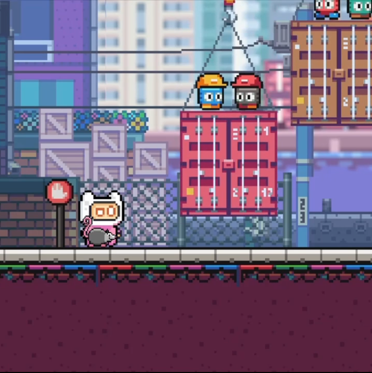

<iframe width="768" height="432" src="https://www.youtube.com/embed/QO4lUSi3T-A" frameborder="0" allow="accelerometer; autoplay; encrypted-media; gyroscope; picture-in-picture" allowfullscreen></iframe>
Reel with highlights of the possum game.

## Introduction 
### Background
- As a fan of low-stress, self-paced, exploratory games, my aim was to create a small, contained narrative with a minimalistic approach. Death is not necessarily looming, but it is possible; there are fun elements that don’t progress the game, but don’t go completely off track (extra places to climb or bounce); and the level design and elements are not limited to single concepts.  
  - I took inspiration from games like Piku Niku, where the fun atmosphere and movements, as well as the playful aesthetics and narrative, are the focus. It’s challenging to do this on a small scale and quickly. 

### Story 
You find a possum eating trash in the city. This is no place for a possum. You feel a deep desire to take him to the wilderness, but first you must earn his trust. If you had better knowledge of possums, you would know that possums pretty much eat trash no matter their location. Your intentions are pure through your own ignorance, and that is fine. There are new dangers within the forest, but you will help the possum get past them to his friends. They enjoy disco, as do you.

## Prototype Design and Specification 
### Core Game Play 2D Side-Scrolling Platformer 

- Collect the possum and escort him to safety. 
  - Jump and climb to reach the goal. 
  - Avoid water, crushing hazards, and enemies. 
- Fulfil periodic requests by collecting and distributing items to overcome obstacles and progress. 
  - Player has a 1-slot HUD inventory, which is suitable. The HUD is hidden except within areas items can be used.  

### Game Flow 
- Player must overcome/solve obstacles to progress and the possum is required to advance levels. 
- As you move through each level, the jumps get more challenging. 
  - In Level 1, missing a jump initially sets you back in progress, but later will result in “death,” thus restarting the level. 
  - In Level 2, most of vertical jumps are significantly wider, but involve a platform affected by physics (see Physics and Parameters for more information). 

### Characters 

- The player is called “Pink.” Pink likes animals and jumping.  
  - Pink can move horizontally and can jump. 
  - Pink has one hit point.  
- The possum is called “Checkers.” 
  - Checkers usually follows and mimics Pink. 
    - Checkers will not follow until objectives to collect him are met each level and certain dangerous obstacles are neutralized. 
  - Checkers is invincible, but sometimes will play dead. 
  
### Physics and Parameters 

- While Checkers is “playing dead,” he will not follow.           
- Certain surfaces have a “bouncy” physics material, allowing the player to jump higher than usual. Some instances are essential, while others are playful. 
  - Level 1: the awnings of buildings are bouncy, and a secondary jump can be made to increase height further. This is necessary at least once--- twice if the player’s velocity is too low when initially striking the surface.  

  - Level 2: when enemies are stomped, there is a delay before the corpse is cleared. Different Colliders allow different effects. 
    - Frog-type enemies: the player can bounce on the smashed enemy until cleared. 
    - Blueberry-type enemies: the player can roll or be kick the enemy, like a ball, until cleared.  
- Non-stationary Surfaces:
  - Moving platforms- Level 1, Port area. 
  - Floating logs- Level 2.  
  - Logs appear to float on the water and sink or resurface at varying speeds when the player interacts with them.  
- Level end- Pink must be accompanied by Checkers to contine. 
  - Plays a cutscene and progresses to the next level or end of the game. 
  
### AI 
- There are two sets of enemies:  
  - Frog-type enemies- patrol without intelligence. 
  - Blueberry-type enemies- patrol with sight and speed up once player is in “sight.”  
 
## Design Notes 
### Level Design Aesthetics 
- Both levels are designed with a series of Tile Maps set to various Layers, some of which have their HSV parameters set to give the illusion of depth. 
  - In Level 1, the Value of layers increase (brighten) the further away a layer is, to give the idea that certain buildings and objects are more distant.  
  - In Level 2, the settings are opposite to accomplish the illusion that distant trees and objects are darker, which adds to the ambiance.   
  
### Storytelling
*See video below.*
- I purposefully kept story telling as minimalistic as possible. 
  - Active communication is accomplished wholly through symbols.
  - Passive communication is accomplished through scene elements, such as signs, billboards, and glowing items.
  

  
  

- Another thing I couldn't tear myself away from that I love from the 16-bit days are cutscenes. Yes, we have cutscenes now, but there was something really fun about cutscenes then. Think back to Chrono Trigger and your first visit to Magus' castle; Terranigma and the skateboarding scene; Final Fantasy III (US) and the opera (amongst so many others). There was something exciting and unique there. So, I made the end of my currently very short game with that in mind. 

<iframe width="768" height="432" src="https://www.youtube.com/embed/-4NyaS6urG0" frameborder="0" allow="accelerometer; autoplay; encrypted-media; gyroscope; picture-in-picture" allowfullscreen></iframe>
  
## Asset, etc. Attributions 
### Graphics: 
- All artwork except those listed below created by/by using original pixel art: 
  -  [GrafxKid](https://grafxkid.tumblr.com/) 
- Pink: 
  - [Pixel Frog](https://assetstore.unity.com/publishers/44925) 
- Speech balloons: 
  - [EDslashEM](https://edslashem.itch.io/rpg-asset-pack-2) 
- Water: 
  - [Bayat Games](https://github.com/BayatGames) License: MIT
- Checkers, possums, and sausage:  
  - JA Scaevola 

### Music: 
- Video Reel: “Not Now – Later” and “Pushy.” 
  - Lemon Jelly: Breezeblock (Aug 2002), with permission from [Fred Deakin](https://freddeak.in/) 
- Levels: “Princess Quest” and “Deep Blue.” 
  - Three Red Hearts - Prepare to Dev Edition, [Tallbeard Studios](https://tallbeard.itch.io/three-red-hearts-prepare-to-dev) License: CC BY 4.0
- End: “Dance Robot ACTIVATE!” 
  - [Loyalty Freak Music](https://freemusicarchive.org/music/Loyalty_Freak_Music) License: CC0

