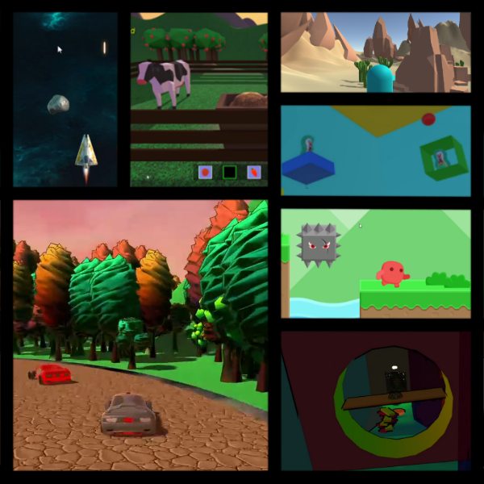

<iframe width="560" height="315" src="https://www.youtube.com/embed/_Pdsl75j5Vg" frameborder="0" allow="accelerometer; autoplay; encrypted-media; gyroscope; picture-in-picture" allowfullscreen></iframe>

A more in-depth look at my mini-game projects.
